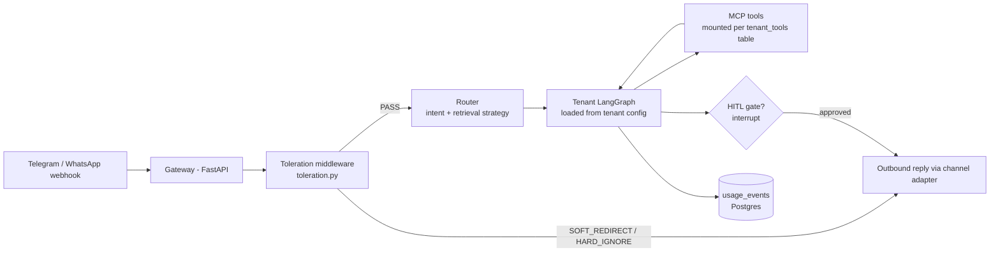

<<<<<<< HEAD
# Jarvis Core — Phase 0 Seed
=======
# Jarvis Core — Phase 0 → Live Deployment
>>>>>>> 0a01ef885a09db033cc4ebce2b8e909e59bc8c95

This folder is the foundation of the multi-tenant agentic platform. It encodes the
architectural decisions that must be right on day one, so tenants 2–10 become
config rows instead of rewrites.
<<<<<<< HEAD
=======

**Status as of 2026-07-10: live in production for one tenant (Kesari Pipes).**
Telegram text and Founder's Core voice are both deployed, unattended, on a
real VM + GPU pod. See `PROGRESS.md` for the session-by-session log and
`WORKING.md` for the voice pipeline's exact wiring.
>>>>>>> 0a01ef885a09db033cc4ebce2b8e909e59bc8c95

## The One Rule
**`tenant_id` flows through everything** — every table, every Chroma collection,
every LangGraph thread ID, every usage log row. This is the difference between a
platform and a pile of scripts.

<<<<<<< HEAD
## High-Level Flow

=======
## Live infrastructure

| Piece | Where | Notes |
|---|---|---|
| Gateway (`main.py`) | DigitalOcean VM, `159.89.166.167`, systemd (`jarvis-gateway`) | Bangalore region. Survives reboots/crashes. |
| Founder's Core frontend | Same VM, systemd (`jarvis-frontend`), port 3000 | Real voice pipeline. Primary UI going forward. |
| Domain | `159.89.166.167.sslip.io` | Free magic-DNS, real Let's Encrypt HTTPS. Swap for a real domain later — one certbot re-run, no code changes. |
| Reverse proxy | nginx on the VM | Routes `/webhook`, `/health`, `/api/founder/*`, `/ws/founder/*`, `/tts/*` → gateway (:8000); everything else → frontend (:3000). |
| LLM compute | RunPod, pod `xl0rixu7dkzh1b`, 1x A40 (48GB VRAM) | On-demand pod, NOT serverless — start/stop manually between sessions to control cost. `ollama serve` currently a manual background process on the pod — **fragile, dies on session reset, needs converting to a real persistent service.** |
| Models on RunPod | `llama3.2:3b-instruct-q8_0`, `qwen2.5:7b-instruct-q8_0`, `mistral:7b-instruct-q8_0` | On the pod's persistent volume disk — survive stop/start, wiped only on Terminate. |
| Database | Supabase (Mumbai region) | Unchanged from Phase 0. |
| Voice STT/TTS | Deepgram (nova-3 STT, Aura-2 TTS) | Proxied through the gateway — browser never holds the API key. |

**Cost note:** the RunPod pod bills ~$0.44/hr while running, ~$0.017/hr while
stopped. **Always stop it between sessions** — a several-hour idle "running"
window is the single biggest avoidable cost in this stack.

## Two frontends, one gateway

- **`founders-core/`** — the business-owner HUD. **This is the primary,
  live UI.** Real voice in/out (mic → Deepgram STT → LLM tool-calling →
  Deepgram TTS), typed chat, barge-in support, report overlays
  (chart/gauge/table). See `WORKING.md` for the exact six-hop flow.
- **`frontend/`** ("Jarvis Command Hub") — customer-facing HUD, work in
  progress, parked for now. Has its own real voice wiring (`voiceClient.ts`)
  but hit an unresolved Deepgram-timeout bug (audio not reliably reaching
  the server) — not currently deployed.

Neither UI owns any logic. All routing, tool-calling, and data access
happens on the gateway — the UIs are thin clients.
>>>>>>> 0a01ef885a09db033cc4ebce2b8e909e59bc8c95

## The Switchbox — how it actually works
MCP gives every tool the same plug shape. The tier toggle is **not** MCP itself —
it is the `tenant_tools` table. At session start, the client reads the enabled
rows for that tenant and mounts only those MCP servers. The Founder Dashboard is
CRUD on that table:

- Tenant upgrades to premium → flip `channel.whatsapp` to enabled, `channel.telegram` off.
- Enable `crm.gohighlevel` for a pro tenant → one row update.
- Agent code never changes. That is the whole trick.

## Model Routing
Compute moved from the dslab SSH tunnel to a RunPod pod — `OLLAMA_URL` in
`.env` is now the only thing that changed; `llm_router.py`'s fallback-chain
design meant nothing else needed touching. Same pattern applies to any
future compute swap.

| task_type | model | why |
|---|---|---|
| intent | llama3.2:3b (RunPod) | runs thousands of times, must be ~free |
| agent_turn | qwen2.5:7b (RunPod) → Claude Haiku (fallback) | qwen proven at multi-tool calls |
| draft | mistral:7b (RunPod) → Claude Sonnet (fallback) | prose quality |
| escalation | Claude Sonnet (cloud, premium tier only) | hard reasoning |

<<<<<<< HEAD
Research strategy is a router flag, not a separate system: fresh/current info →
web_search tool; tenant knowledge → RAG on the tenant's Chroma collection.

Fallback chains make future infrastructure (own GPUs, cloud pools, load
balancing) a config change: `[own_gpu, cloud_api]` replaces `[ollama_local, cloud_api]`.

## Production corrections to the lab patterns
- `MemorySaver` is in-memory only. Production uses **LangGraph's Postgres
  checkpointer** so paused HITL approvals survive restarts.
- Secrets never live in the DB — `api_key_refs` stores pointers to env vars /
  secret manager, not raw keys.
- Every money-touching action (payments, large orders, B2C renewals) goes through
  a mandatory HITL `interrupt()` gate — the exact pattern from the HITL lab.

## Phase Plan
- **Phase 0 (now):** this seed. One tenant (Kesari), Telegram, local Chroma,
  Postgres schema, toleration middleware, usage logging. End-to-end slice.
- **Phase 1:** Founder Dashboard (Streamlit) — reads `usage_events`, toggles
  `tenant_tools`. Role-based views (owner vs operator) per the earlier design.
- **Phase 2:** Second tenant onboarded purely via config to prove isolation.
  Demo the switch flip: Telegram → WhatsApp adapter for a premium tenant.
- **Phase 3:** B2C Life OS module — deferred deliberately. The CA agent touches
  bank data and money; it ships only with hard HITL gates and after B2B revenue.

## Files
- `schema.sql` — the multi-tenant foundation (run against Postgres/Supabase)
- `toleration.py` — strike system with reputation-based limits
- `llm_router.py` — model matrix + provider fallback chain (also the eval
  engine's provider layer — see below)
- `tenant.kesari.example.yaml` — tenant = config, never code

## Eval Engine (Phase 0.5)
Added 2026-07-12, first real data 2026-07-13. A separate, out-of-band system
for grading candidate models BEFORE they get promoted into `llm_router.py`'s
`MODEL_MATRIX`. Not part of the production request path — a bug in the eval
engine cannot take down the Telegram webhook or the founder voice pipeline.

**Infra roles (as of 2026-07-13 — this section is the source of truth, not
any chat transcript):**
| Box | Role | Status |
|---|---|---|
| dslab (172.18.40.103, SSH tunnel) | Production inference (main.py) + sole eval candidate source right now | Live, campus-network only |
| RunPod | Was meant to host eval candidates | **Abandoned** — Community Cloud GPU reclaim persisted across every check; see PROGRESS.md 2026-07-13. Backlog: real replacement after July 18 |
| Together.ai | Candidate/judge option | Wired, unused — requires $5 minimum deposit before any call works, no free tier confirmed live |
| NVIDIA NIM | Candidate/judge option | Wired, unused — model name is an unverified guess, do not trust scores from it yet |
| DigitalOcean VM | Eval orchestrator (`eval_api.py`), separate FastAPI process from the gateway; ALSO hosts the founder voice pipeline's frontends (see below) | No GPU |
| Gemini, Groq | Judges | Both confirmed working (Gemini needs `X-goog-api-key` header + `-latest` model alias, see PROGRESS.md) |
| Anthropic | Judge | Wired, key currently invalid (401), deferred |

**Flow:** `generate` (candidate) → `tier1_rules` (local regex/keyword/language
checks, free) → conditional skip on hard-fail → `tier2_judge` (CRAFT rubric:
correctness, relevance, adherence, faithfulness, tone) → `aggregate` →
`persist` (Supabase `llm_evaluations`).

**Turning a run into a verdict:** `catalog_from_run.py <run_id>` computes
stats via `scorecard.compute_stats()` and upserts a `model_catalog` row with
a green/yellow/red `signal`. This is manual today — the seed of a future
"run via button" flow, not the flow itself yet.

**Real results as of 2026-07-13** (dslab only — see PROGRESS.md for the
cross-judge detail): qwen2.5:7b-instruct 🟡 YELLOW (75-80%, cross-judged),
llama3.2:3b-instruct 🔴 RED (55%), mistral:7b-instruct 🔴 RED (30%, single
judge only).

**Files:** `eval_cases.py` (20-case test grid, 5 categories, Kesari-only —
tenant-aware refactor still pending), `eval_graph.py` (LangGraph),
`eval_api.py` (FastAPI orchestrator), `scorecard.py` (report + signal
computation), `catalog_from_run.py`, `model_catalog_schema.sql` +
`model_catalog_add_signal.sql`, `eval_schema.sql`, `debug_judge.py` /
`list_gemini_models.py` (diagnostic tools, keep these — they're what
actually found both Gemini bugs).

See `PROGRESS.md` 2026-07-12 and 2026-07-13 entries for the full decision
log, including the RunPod outage, the Together/NIM investigation, and the
known gap where `model_catalog` can't yet hold more than one judge's
verdict per model without overwriting.

## Founder Voice Pipeline
Discovered/connected to this thread 2026-07-13; documented in full in
`WORKING.md` (the authoritative reference — this is a pointer, not a copy).
A second, already-live system: talk to Jarvis by voice or typed chat as the
founder, get spoken answers backed by real tool-calling.

**Two frontends, one gateway:** `frontend/` (customer HUD) and
`founders-core/` (founder HUD) are both thin clients over `main.py` — no
logic lives in either UI. Live at https://159.89.166.167.sslip.io/ (DO VM).
Source: https://github.com/Sourav-codeblocks/jarvis-core-git.

**Six-hop flow:** browser mic → `voice_bridge.py` → Deepgram (nova-3 STT) →
`founder_ws.py`'s `route_founder_query()` (real LLM tool-calling via
`qwen2.5:7b` over the dslab tunnel) → the matching tool function → Postgres/
ChromaDB → spoken answer → Deepgram Aura-2 TTS → browser.

**Mock vs. real, as of today:** `get_usage_report` and `get_catalog_report`
are real (query Supabase/ChromaDB). `get_revenue_report`, `get_runway_report`,
`get_pipeline_report`, `get_briefing_report` are mock fixtures — this is
what the "REPORTS" panel on the live HUD is actually showing right now.

**Does NOT talk to the eval engine.** No tool queries `model_catalog` or
`llm_evaluations` yet — asking the founder HUD about model eval results
will not work until that tool is built. See PROGRESS.md NEXT list.

**Known gaps** (documented in `WORKING.md`, repeated here since they overlap
with eval-engine work): `tenant_id` hardcoded to 1, same as `main.py`;
`route_founder_query()` bypasses `llm_router.py` entirely, calls Ollama
direct; no `usage_events` logging for founder queries; the
`kb_keshri_pipes` vs `kb_kesari_pipes` Chroma name mismatch
(code_review.md #4) is present here too, still unfixed anywhere.

## What Phase 0 still needs built (next sessions)
1. FastAPI gateway with Telegram webhook (you know this from Sprout)
2. `standard_business_v1` LangGraph (analyse → act → HITL gate → respond)
3. Per-tenant ingest script (Chroma collection per tenant)
4. MCP server skeleton for the first tool + client-side mounting from `tenant_tools`
5. Postgres checkpointer wiring
=======
## Known gaps (see PROGRESS.md for full session detail)

- **`get_catalog_report`'s similarity search unreliable** — qwen2.5 often
  calls the tool without a search term, falling back to "show 8 generic
  products" instead of a targeted answer. Debug logging already added to
  `founder_ws.py` (`DEBUG tool call: ...` in the gateway logs) — check that
  first next session before guessing at a fix.
- **`ollama serve` on RunPod is not a persistent service** — needs a real
  startup script so it survives pod restarts without manual intervention.
- **Founder's Core's revenue/runway/pipeline/briefing tools are still mock
  fixtures** — same class of fix `founder_reports.py` already solved for
  the retired REST-based Founder's Core build. Point these at real
  Supabase queries once there's real business data to query.
- **No auth on `/ws/founder/*` or `/tts/*`** — fine while the URL is
  effectively private; needs a real gate before wider exposure.
- **Founder voice/text has no toleration middleware** — by design, per
  `founder_ws.py`'s own docstring (founder-only, not customer-facing).
  Telegram already has the real toleration/reputation system live.

## Files
- `schema.sql` — the multi-tenant foundation (run against Postgres/Supabase)
- `toleration.py` — strike system with reputation-based limits (Telegram path only)
- `llm_router.py` — model matrix + provider fallback chain
- `founder_ws.py` — founder tool registry + LLM tool-calling brain (voice AND typed chat)
- `voice_bridge.py` — mic audio ↔ Deepgram STT bridge
- `tts.py` — Deepgram TTS proxy
- `founders-core/` — primary live frontend
- `frontend/` — parked customer-facing frontend (Jarvis Command Hub)
- `WORKING.md` — the voice pipeline's exact architecture reference

## Phase Plan
- **Phase 0 (done):** local dev seed — one tenant, Telegram, local Chroma, toleration middleware.
- **Phase 0.5 (done, this session):** real deployment — VM, RunPod GPU, live HTTPS, real voice pipeline for Founder's Core.
- **Phase 1 (next):** fix the catalog tool-calling bug; make Ollama a real persistent service on RunPod; point remaining founder tools at real data; add auth to the voice/founder routes.
- **Phase 2:** Second tenant onboarded purely via config to prove isolation.
- **Phase 3:** B2C Life OS module — deferred deliberately, per original plan.
>>>>>>> 0a01ef885a09db033cc4ebce2b8e909e59bc8c95
