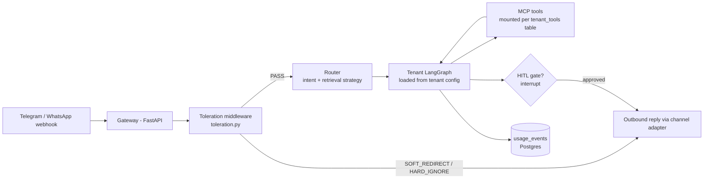

# Jarvis Core — Phase 0 Seed

This folder is the foundation of the multi-tenant agentic platform. It encodes the
architectural decisions that must be right on day one, so tenants 2–10 become
config rows instead of rewrites.

## The One Rule
**`tenant_id` flows through everything** — every table, every Chroma collection,
every LangGraph thread ID, every usage log row. This is the difference between a
platform and a pile of scripts.

## High-Level Flow

## The Switchbox — how it actually works
MCP gives every tool the same plug shape. The tier toggle is **not** MCP itself —
it is the `tenant_tools` table. At session start, the client reads the enabled
rows for that tenant and mounts only those MCP servers. The Founder Dashboard is
CRUD on that table:

- Tenant upgrades to premium → flip `channel.whatsapp` to enabled, `channel.telegram` off.
- Enable `crm.gohighlevel` for a pro tenant → one row update.
- Agent code never changes. That is the whole trick.

## Model Routing (llm_router.py)
| task_type | model | why |
|---|---|---|
| intent | llama3.2:3b (local) | runs thousands of times, must be ~free |
| agent_turn | qwen2.5:7b (local) → Claude Haiku (fallback) | qwen proven at multi-tool calls in your own lab |
| draft | mistral:7b (local) → Claude Sonnet (fallback) | prose quality |
| escalation | Claude Sonnet (cloud, premium tier only) | hard reasoning |

Research strategy is a router flag, not a separate system: fresh/current info →
web_search tool; tenant knowledge → RAG on the tenant's Chroma collection.

Fallback chains make future infrastructure (own GPUs, cloud pools, load
balancing) a config change: `[own_gpu, cloud_api]` replaces `[ollama_local, cloud_api]`.

## Production corrections to the lab patterns
- `MemorySaver` is in-memory only. Production uses **LangGraph's Postgres
  checkpointer** so paused HITL approvals survive restarts.
- Secrets never live in the DB — `api_key_refs` stores pointers to env vars /
  secret manager, not raw keys.
- Every money-touching action (payments, large orders, B2C renewals) goes through
  a mandatory HITL `interrupt()` gate — the exact pattern from the HITL lab.

## Phase Plan
- **Phase 0 (now):** this seed. One tenant (Kesari), Telegram, local Chroma,
  Postgres schema, toleration middleware, usage logging. End-to-end slice.
- **Phase 1:** Founder Dashboard (Streamlit) — reads `usage_events`, toggles
  `tenant_tools`. Role-based views (owner vs operator) per the earlier design.
- **Phase 2:** Second tenant onboarded purely via config to prove isolation.
  Demo the switch flip: Telegram → WhatsApp adapter for a premium tenant.
- **Phase 3:** B2C Life OS module — deferred deliberately. The CA agent touches
  bank data and money; it ships only with hard HITL gates and after B2B revenue.

## Files
- `schema.sql` — the multi-tenant foundation (run against Postgres/Supabase)
- `toleration.py` — strike system with reputation-based limits
- `llm_router.py` — model matrix + provider fallback chain
- `tenant.kesari.example.yaml` — tenant = config, never code

## What Phase 0 still needs built (next sessions)
1. FastAPI gateway with Telegram webhook (you know this from Sprout)
2. `standard_business_v1` LangGraph (analyse → act → HITL gate → respond)
3. Per-tenant ingest script (Chroma collection per tenant)
4. MCP server skeleton for the first tool + client-side mounting from `tenant_tools`
5. Postgres checkpointer wiring
