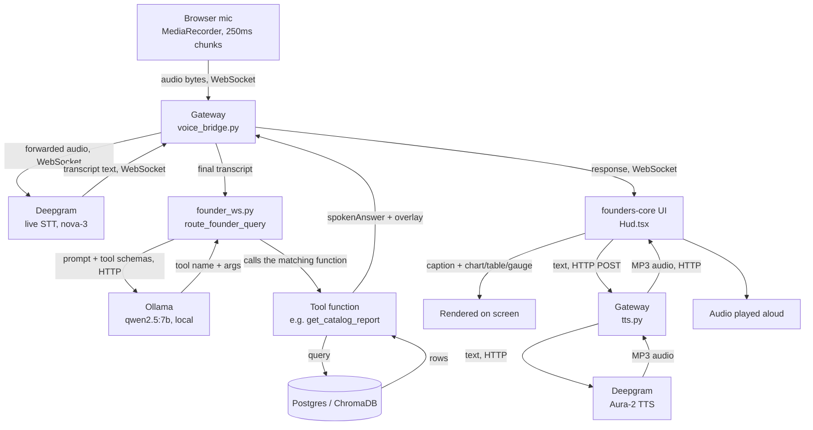

# Jarvis Core — Founder Voice Pipeline (Working Notes)

This document is the working reference for how the Founder's Core voice
pipeline actually works, end to end — what calls what, which pieces are
real vs. mocked today, and where the seams are for swapping providers
later. Pairs with `README.md` (project overview) and `PROGRESS.md`
(dated log); this file is the "how it fits together" reference.

## Two frontends, one gateway

There are now two separate web UIs, both talking to the same
`main.py` gateway:

- **`frontend/`** — the customer-facing HUD ("Jarvis Command Hub").
- **`founders-core/`** — the business-owner HUD, with reports, tables,
  and voice input/output. This document covers this one.

Neither UI owns any logic. All routing, tool-calling, and data access
happens on the gateway — the UIs are thin clients.

## The six-hop flow



### Step by step

1. **Capture** — `voice.ts`'s `startVoiceSession()` opens the mic
   (`getUserMedia`), records in 250ms chunks (`MediaRecorder`), and
   streams them over a WebSocket to the gateway's
   `/ws/founder/{tenant_slug}/voice` route.
2. **Transcribe** — `voice_bridge.py` is a WebSocket *server* to the
   browser and a WebSocket *client* to Deepgram at the same time. It
   forwards every audio chunk straight to Deepgram's live STT endpoint
   (`nova-3`, `language=multi` for English/Hindi) and reads transcripts
   back on that same outbound connection.
3. **Hand off** — once Deepgram marks an utterance `speech_final`,
   `voice_bridge.py` calls `route_founder_query()` from `founder_ws.py`
   — the exact same function the typed-chat path uses. Voice and text
   share one brain.
4. **Reason** — `route_founder_query()` sends the transcript to
   `qwen2.5:7b-instruct-q8_0` via Ollama (reached through the SSH tunnel
   to `dslab`), along with JSON-schema definitions of every founder
   tool. The model decides which tool (if any) answers the question —
   this is real tool-calling, not keyword matching.
5. **Fetch the data** — the LLM never touches a database. It only
   returns a tool name (+ arguments, e.g. a catalog search term). The
   gateway then calls the matching Python function, which queries
   Postgres (`usage_events`, via Supabase) or ChromaDB
   (`kb_keshri_pipes`, via `ingest.py`'s collection) directly.
6. **Answer + speak** — the tool's `{spokenAnswer, overlay}` result
   flows back through `voice_bridge.py` to the browser over the
   original WebSocket. `Hud.tsx` renders the overlay (chart/gauge/
   table/report) immediately. Separately, `speak()` in `voice.ts` fires
   a **new, independent HTTP request** to the gateway's `/tts/founder`
   route (`tts.py`), which proxies to Deepgram's Aura-2 TTS and streams
   MP3 audio back for the browser to play.

The typed-chat path (`dataAdapter.ts` → `/ws/founder/{tenant_slug}`)
skips steps 1–3 and joins directly at step 4 — same reasoning, same
tools, same data.

## File map

| File | Role |
|---|---|
| `founder_ws.py` | The brain. `route_founder_query()` (LLM tool-calling), the founder tool registry, and the typed-chat WebSocket route. |
| `voice_bridge.py` | The ears. Bridges browser audio to Deepgram STT, then calls into `founder_ws.py` once an utterance is complete. |
| `tts.py` | The mouth. Proxies text to Deepgram's Aura-2 TTS so the browser never holds the API key. |
| `founders-core/src/lib/voice.ts` | Frontend voice I/O seam — `startVoiceSession()` (mic capture) and `speak()` (caption + TTS playback). |
| `founders-core/src/lib/dataAdapter.ts` | Frontend seam for the typed-chat path — `fetchJarvisResponse()`. |
| `founders-core/src/components/hud/Hud.tsx` | Orchestrates state (standby/listening/thinking), wires mic and type input to the above. |

## What's real vs. mock today

| Tool | Status |
|---|---|
| `get_revenue_report` | Mock fixture |
| `get_runway_report` | Mock fixture |
| `get_pipeline_report` | Mock fixture |
| `get_briefing_report` | Mock fixture |
| `get_usage_report` | **Real** — queries `usage_events` via Supabase |
| `get_catalog_report` | **Real** — queries `kb_keshri_pipes` via ChromaDB, with a real similarity search when the model extracts a search term |

## Environment variables required

All in `.env`, loaded independently by each module (so import order in
`main.py` never matters — see the self-sufficiency note in
`voice_bridge.py`/`tts.py`):

```
SUPABASE_URL=...
SUPABASE_SECRET_KEY=...
TELEGRAM_BOT_TOKEN=...
DEEPGRAM_API_KEY=...
```

## Known gaps / next steps

- **No barge-in** — the "Call" button in `Hud.tsx` is a UI stub
  (`toggleCall` only flips a label, no continuous listening or audio
  interruption). This is the next planned piece.
- **tenant_id hardcoded to 1** everywhere in this path — same seam as
  the Telegram webhook in `main.py`. Needs the same tenant-dynamic
  resolution work noted in `code_review.md`.
- **No usage_events logging for founder queries yet** — every Telegram
  LLM call writes a row; this path doesn't yet, so founder query cost/
  latency isn't tracked.
- **`route_founder_query()` doesn't go through `llm_router.py`** — it
  calls Ollama directly rather than `llm_router.route()`, because that
  function expects a caller-supplied `providers` dict and usage
  logger this bridge doesn't wire up yet. Worth consolidating once
  usage logging is added here.
- **Chroma collection name mismatch persists** — `kb_keshri_pipes` (used
  here and in `main.py`) vs. `kb_kesari_pipes` (seeded in `schema.sql`).
  Flagged in `code_review.md`; not yet fixed.

## Running it locally

Same three-terminal pattern as `COMMANDS.md`, plus the SSH tunnel to
Ollama:

```bash
# T1 — gateway
cd ~/Documents/IIT_Mandi_AgenticAI/Jarvis_Core && conda activate jarvis-core
uvicorn main:app --reload

# T2 — Founder's Core frontend
cd ~/Documents/IIT_Mandi_AgenticAI/Jarvis_Core/founders-core
bun run dev

# T3 — Ollama tunnel (must stay open for tool-calling to work)
ssh -L 11434:localhost:11434 teaching@172.18.40.103
```

Then open the Founder's Core URL Vite prints (typically
`http://localhost:8080/`).
