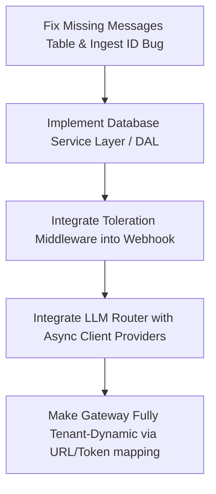

# Jarvis Core (Phase 0) Codebase Review

This document provides a detailed architectural and code-level review of the **Jarvis Core** Phase 0 seed codebase. The review assesses the current implementation, highlights strengths, identifies critical bugs/gaps, and proposes concrete improvements for transition to a robust, multi-tenant platform.

---

## 🏗️ Architectural Overview & Strengths

The Phase 0 codebase lays a solid foundation for a multi-tenant agentic platform. Key architectural highlights include:

*   **Multi-Tenant Schema Design**: Emphasizing "The One Rule" (`tenant_id` flows through everything) prevents logical data leaks and prepares the system to scale to multiple tenants seamlessly.
*   **The Switchbox Concept (`tenant_tools`)**: Decoupling tool integration from the agent graph is excellent. Controlling tool enablement per tenant via SQL updates avoids code drift and makes feature tiering easy to manage.
*   **Model Routing Matrix with Fallbacks (`llm_router.py`)**: Matching tasks to specific models (e.g., cheap local models for intent classification and capable cloud models for reasoning) is cost-effective and resilient. The fallback chain guarantees uptime if local inference fails.
*   **Strike-Based Toleration Middleware (`toleration.py`)**: Managing API usage and user behavior via a strike system is vital for public-facing chat interfaces. Boosting limits based on user reputation is a smart business-centric design.

---

## 🚨 Critical Gaps & Potential Bugs

Below are the most severe issues identified in the codebase that will cause runtime crashes or design failures.

### 1. Missing `messages` Table in `schema.sql`
*   **File**: [schema.sql](file:///Users/sourabhtiwari/Documents/IIT_Mandi_AgenticAI/Jarvis_Core/schema.sql)
*   **Issue**: The SQL schema defines several tables but **completely omits the `messages` table**.
*   **Impact**: When running the API server (`main.py`), querying or inserting chat history will trigger a database exception (table not found), crashing the webhook on the very first incoming user message.
*   **Fix**: Add the `messages` table definition to the schema script:
    ```sql
    CREATE TABLE messages (
        id          BIGSERIAL PRIMARY KEY,
        tenant_id   BIGINT NOT NULL REFERENCES tenants(id),
        user_id     BIGINT NOT NULL REFERENCES users(id),
        role        TEXT NOT NULL CHECK (role IN ('user', 'assistant', 'system')),
        text        TEXT NOT NULL,
        created_at  TIMESTAMPTZ DEFAULT now()
    );
    CREATE INDEX idx_messages_user ON messages (user_id, created_at DESC);
    ```

### 2. Defective Ingest Deduplication (Stale Vectors)
*   **File**: [ingest.py](file:///Users/sourabhtiwari/Documents/IIT_Mandi_AgenticAI/Jarvis_Core/ingest.py#L59-L69)
*   **Issue**: The code generates the Chroma document ID using a hash of the content:
    ```python
    doc_id = f"{row['product_id']}_{hashlib.sha1(doc.encode()).hexdigest()[:10]}"
    ```
    If product details (such as price or stock) change, the content hash changes, resulting in a new `doc_id`.
*   **Impact**: When calling `collection.upsert()`, Chroma will insert a brand-new vector rather than updating the old one. The Vector Database will end up with stale copies of products. During RAG retrieval, the model will fetch both the old and new product info, causing contradictory LLM responses (e.g., stating two different prices or stock statuses).
*   **Fix**: Use the `product_id` (or a tenant-prefixed identifier like `f"{tenant_slug}_{product_id}"`) as the primary document ID. This ensures `upsert` actually overwrites old records when product details change.

### 3. Hardcoded Multi-Tenancy Seams
*   **File**: [main.py](file:///Users/sourabhtiwari/Documents/IIT_Mandi_AgenticAI/Jarvis_Core/main.py)
*   **Issue**: Multiple key variables are hardcoded:
    *   `tenant_slug="keshri-pipes"` is hardcoded in the webhook.
    *   `tenant_id: 1` is hardcoded in `ask_llm` and database writes.
    *   Chroma collection `kb_keshri_pipes` is globally initialized at startup.
    *   The single `TELEGRAM_BOT_TOKEN` environment variable prevents running bots for other tenants.
*   **Impact**: The app cannot support multiple tenants without codebase modification, violating "The One Rule".
*   **Fix**: Extract the tenant configuration dynamically. Map incoming Telegram requests to the correct tenant ID/slug using the bot's username or webhook path, and retrieve tool configurations, tokens, and collections from the database.

---

## 🔍 File-by-File Analysis

### 1. `main.py` (FastAPI Gateway)
*   **Missing Integrations**: Neither `llm_router.py` nor `toleration.py` are imported or used in the gateway. The webhook communicates directly with a hardcoded Ollama instance.
*   **Synchronous Blockers**: Calling local LLM endpoints synchronously inside an async route (or using sync network requests) blocks the event loop. This prevents FastAPI from serving concurrent requests.
*   **Global Client Instantiation**: Initializing the Chroma client and embedding function globally prevents routing search requests to other tenant collections.
*   **No Exception Handling**: The Telegram webhook does not catch errors. If the LLM goes down, the API returns a `500 Internal Server Error`, prompting Telegram to retry the payload indefinitely and spam the server.

### 2. `llm_router.py` (Model Switchboard)
*   **Uncaught KeyError**:
    ```python
    call = providers[provider_name]
    ```
    If `providers` is missing a key (e.g., `anthropic_api` is not configured), it will throw a `KeyError` outside the `try` block, crashing the router instead of falling back to the next model in the list.
*   **Lack of Interface**: The router is model-agnostic but depends on caller-provided dictionary mappings and logging callbacks, which increases boilerplate for the consumer.

### 3. `toleration.py` (Strike System)
*   **Missing Dependency**: The module assumes the presence of a database interface `db` with specific methods (`get_moderation_state`, `increment_offtopic`, `set_hard_ignore`). This interface is not implemented in the project.
*   **Heuristic Intent Check**: Off-topic checking is slow and resource-heavy because it queries an LLM prompt. Simple keyword filtering (e.g., detecting greetings or gibberish) before querying an LLM would reduce latency and cost.
*   **Strict String Matching**: The string matching `answer.startswith("NO")` is vulnerable to verbose LLM formats. Enforcing JSON output or mapping to a regex pattern is more reliable.

### 4. `tenant.kesari.example.yaml`
*   **Discrepancy**: The tenant slug is named `kesari-pipes`, while the DB seeds and code use `keshri-pipes`. This spelling inconsistency must be corrected.

---

## 📈 Suggested Path Forward & Recommendations

To bring Jarvis Core to a production-ready state, consider the following timeline of improvements:



### Proposed Action Items:
1.  **Correct Schema and Ingest DB ID**: Add `messages` schema and change document IDs in `ingest.py` to be exactly `product_id`.
2.  **Unify DB Queries**: Create a utility module (e.g., `db_client.py`) that wraps Supabase queries. This resolves the missing `db` methods in `toleration.py` and centralizes multi-tenant filters.
3.  **Implement Provider Clients**: Write standard clients for Ollama and Claude, wrapping them in async functions to prevent blocking the event loop.
4.  **Resolve Webhook Error Handling**: Introduce a top-level try-except wrapper inside the Telegram webhook to capture failures, notify support, and return a clean HTTP 200 to Telegram.
